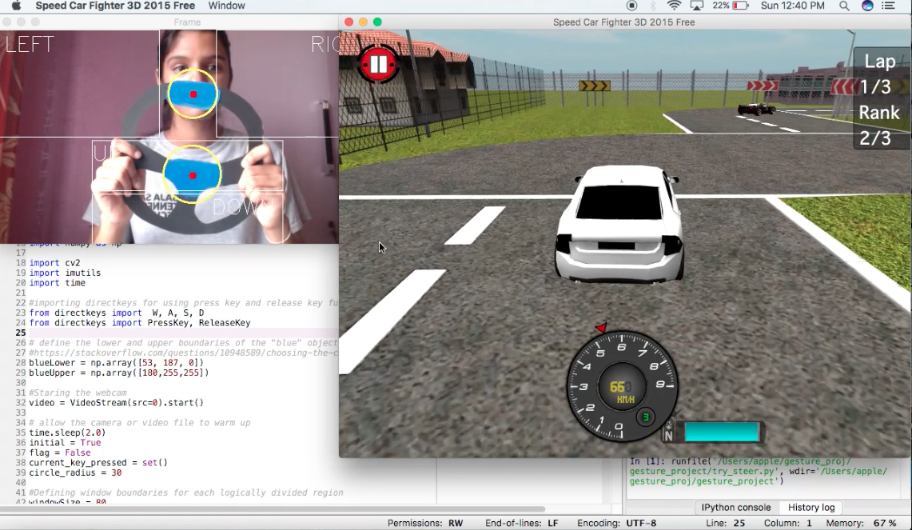

## Gesture Control Gaming 

Hey guys,
this is my first ever pyhton project. Here I'm using openCV and Numpy libraries of Python to control a racing game with the steering wheel. It gives you a virtual driving experience. 

## Description

The screen is logically divided into 4 parts. When a particular color (in my case Blue) is detected in those parts a key press is called. Suppose Blue color was detected on the top left part of screen then a "A" key press is initiated and the car will turn left.
The color boundaries were set using color.py in which we set range of HSV values for Blue color. Key press and key release fucntion was used from directkeys.py file. 

I'm using a MacOS and Spyder to run my project. This code will be compatable with any game on MacOS. If you are using WindowsOS then you might have modify the directkeys.py file

Follow the steps in requirements file to get the setup ready, then you could run the color.py file and directkeys.py file in order to set them up and make sure they're working correctly. Then you could run controlling_steer.py finally to get the output window.

